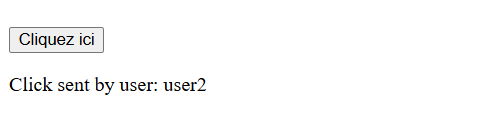
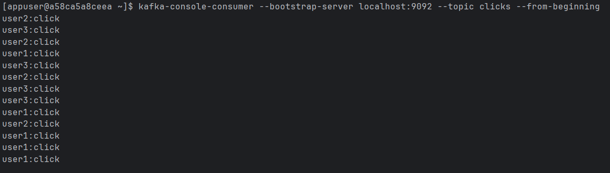
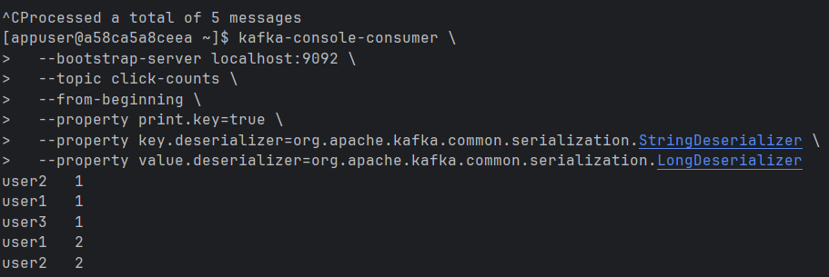
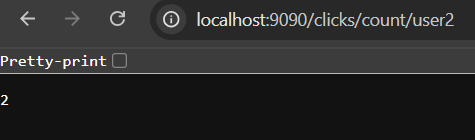

# Click Counter App

This application demonstrates a complete Kafka Streams pipeline for tracking click events.

## Architecture

- A Spring Boot web app exposes a button that sends a `click` event with a random `userId` to Kafka topic `clicks`.
- A Kafka Streams processor groups click events by user and counts them in real-time.
- The counts are published to topic `click-counts`.
- A separate Spring Boot REST service consumes this data and exposes APIs:
  - `/clicks/count/all`: Get click count per user.
  - `/clicks/count/{userId}`: Get click count for a specific user.

## Run

Make sure Kafka is running (`docker-compose up`) then:

```bash
cd click-counter-app
mvn spring-boot:run
```

## Example Output

```
User: user1 -> Clicks: 3
User: user2 -> Clicks: 5
```

## Interface & Workflow Overview

This application simulates user clicks, processes them using Kafka Streams, and exposes real-time analytics via a REST API.

🔘 Simple HTML interface with a button to trigger a Kafka event (click by a random user).



📥 Raw Kafka consumer output for the clicks topic showing individual user clicks.



📊 Kafka consumer for click-counts topic, showing aggregated click counts per user.



🔍 REST API: Get clicks for a specific user via GET /clicks/count/{userId}.



🧾 REST API: View all users' click counts via GET /clicks/count/all.


