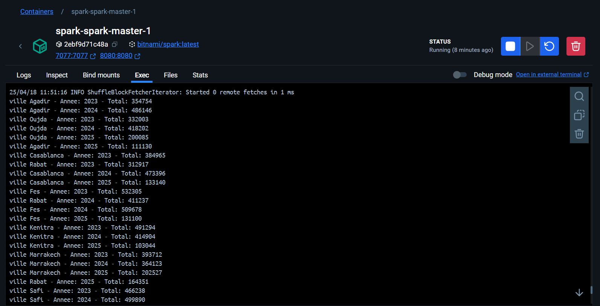

# 🧠 TP Spark — Traitement parallèle et distribué avec Apache Spark

Ce projet est une démonstration du traitement **parallèle** et **distribué** de données volumineuses avec **Apache Spark** en utilisant Java, testé localement puis exécuté sur un **cluster Docker**.

---

## 📋 Sujet

**Exercice 1**

1. Développer une application Spark permettant, à partir d’un fichier texte `ventes.txt` contenant les ventes d’une entreprise dans différentes villes, de :
   - Déterminer le **total des ventes par ville**

   **Format du fichier :**
   ```
   date ville produit prix
   12/04/2025 Fes Iphone15 9200
   10/04/2025 Rabat MacPro 14500
   09/04/2025 Casablanca SamsungS24 12000
   ```

2. Développer une seconde application qui calcule :
   - Le **total des ventes par ville et par année**

---

## 📁 Arborescence

```
TP_Spark/
├── src/
│   └── main/java/Main.java
├── ventes.txt
├── pom.xml
└── target/TP_Spark-1.0-SNAPSHOT.jar
```

---

## ⚙️ Technologies utilisées

- **Java 8**
- **Apache Spark 3.3+**
- **Maven**
- **Docker & Docker Compose**
- **Bitnami Spark Docker image**

---

## 🚀 Exécution locale (test)

📸 Exercice 1 :


---

## 🐳 Exécution sur un cluster Spark (via Docker)

### 🔧 1. Arborescence recommandée

```
spark-cluster/
├── docker-compose.yml
└── app/
    ├── TP_Spark-1.0-SNAPSHOT.jar
    └── ventes.txt
```

### ▶️ 2. Lancer le cluster

```bash
docker-compose up -d
```

👀 Interface Spark : [http://localhost:8080](http://localhost:8080)

---

### 📤 3. Exécuter l'application

```bash
spark-submit --class Main --master spark://spark-master:7077 /app/TP_Spark-1.0-SNAPSHOT.jar

```

---

## 📸 Résultats dans le cluster Spark

📌 le prix total des ventes des produits par ville et par année.

**Exécution visible dans Docker Desktop > spark-master > Exec :**


 

---

## ✍️ Auteur

**Saad El Mabrouk**  
📚 TP Big Data Spark
📅 Avril 2025
