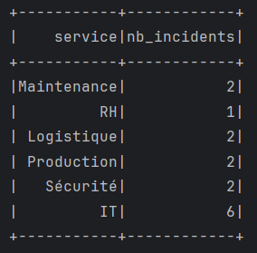
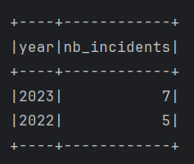

# 🧠 TP Spark SQL — Traitement des incidents d’une entreprise industrielle

Ce projet est une démonstration du traitement de données avec **Apache Spark SQL en Java**, appliqué à un fichier d’incidents industriels. L’application est développée et testée localement en Java, puis déployable sur un cluster Spark (via Docker).

---

## 📋 Sujet

### Exercice : Traitement des incidents

Développer une application Spark permettant, à partir d’un fichier CSV `incidents.csv` contenant les incidents d’une entreprise, de :

1. Afficher le nombre d’incidents par service.
2. Afficher les **deux années** où il y a eu **le plus d’incidents**.

### Format du fichier :
```csv
Id,titre,description,service,date
1,Panne serveur,Serveur crashé,IT,2023-03-15
2,Fuite d'eau,Canalisation percée,Maintenance,2022-06-20
3,Erreur SAP,Transaction échouée,IT,2023-08-09
...
```
## 📁 Arborescence

TP_SparkSQL/

├── src/

│   └── main/java/ServiceIncidents.java

├── incidents.csv

├── pom.xml

## ⚙️ Technologies utilisées
Java 11+

Apache Spark 3.5.5

Spark SQL

Maven

## 📸 Résultats attendus
Affichage du nombre d’incidents par service (ex : IT, Maintenance…)


Affichage des 2 années avec le plus grand nombre d’incidents (ex : 2023, 2022)


## ✍️ Auteur
Mohamed Abiaba
📚 TP Big Data Spark SQL
📅 Mai 2025
