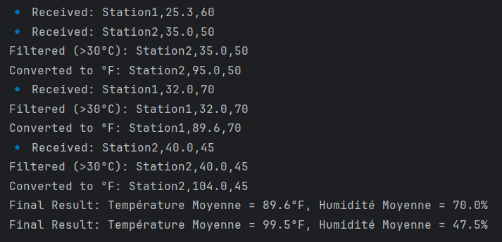
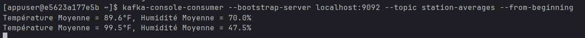

# Weather Stream App

A Kafka Streams project that processes simulated weather data.

## Functionality

- Consumes weather metrics (e.g., temperature, humidity) from a Kafka topic.
- Applies stream transformations, filters, or aggregations (e.g., average temperature).
- Output can be written to another Kafka topic for use by consumers or dashboards.

## Usage

Start Kafka using:
```bash
docker-compose up -d
```

Then:
```bash
cd weatherStreamApp
mvn spring-boot:run
```

## Note

Make sure a topic like `weather-data` exists and is being fed with JSON-formatted weather events.

## Screenshot

This screenshot shows the Kafka producer sending raw weather data to the weather-data topic. Each record follows the format:
``` 
StationName,Temperature(°C),Humidity(%).
```


This screenshot displays the real-time log of the Kafka Streams application:

- It filters out records where temperature > 30°C.

- Converts Celsius to Fahrenheit.

- Then calculates average temperature and humidity per station.

The logs show filtered entries and final results like:



This is the output of consuming the processed data from the station-averages topic.
Each message represents a station’s average temperature and humidity, calculated in real-time after transformations by the Kafka Streams app:




